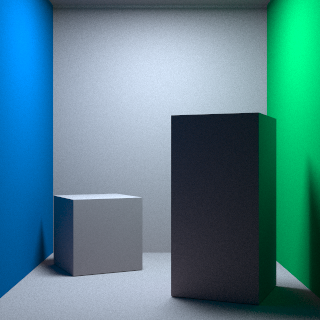

# rendererer
Ray tracing via physically-based Monte Carlo for 3D computer graphics fun.

```bash
cd src
make
./rendererer ../scenes/cornell_box.obj ../scenes/cornell_box.mtl
```

View image in a browser while rendering: `img_viewer/index.html` (via
[websocket_ctube](https://github.com/bryance-oyang/websocket_ctube))

## Tests



Can only render triangles. `.obj` file must have only triangles.

Dispersive glass: set material name in `.mtl` to `CAUCHY_#_#` where # are floats
indicating the Cauchy coefficients A and B in order (n = A + B / wavelen^2).

Adjust image size, number of threads, etc in `src/macro_def.h` and re-`make`.
