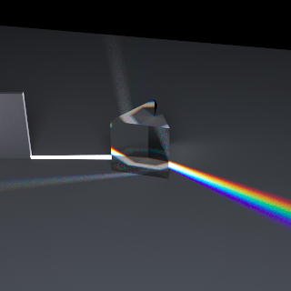

# rendererer
Ray tracing from scratch via physically-based Monte Carlo for 3D computer
graphics fun.




Build dependencies: `g++` or similar for C++17, `make`, `POSIX` (aka sorry Windows)
```bash
cd src
make
./rendererer ../scenes/cornell_box.obj ../scenes/cornell_box.mtl
```

View image in a browser while rendering: `python -m http.server` and open
browser to `http://localhost:8000/img_viewer/index.html` (via
[websocket_ctube](https://github.com/bryance-oyang/websocket_ctube))

No smooth normals (hence blobby glass sphere). Can only render triangles. `.obj` file must have only triangles. Tested from [blender](https://www.blender.org/) export (but blender doesn't export transparent glass correctly).

Dispersive glass: set material name in `.mtl` to `CAUCHY_#_#` where # are floats
indicating the Cauchy coefficients A and B in order (n = A + B / wavelen^2).

Adjust image size, number of threads, etc in `src/macro_def.h` and re-`make`.

## Todo
Metropolis-Hastings for better everything.
